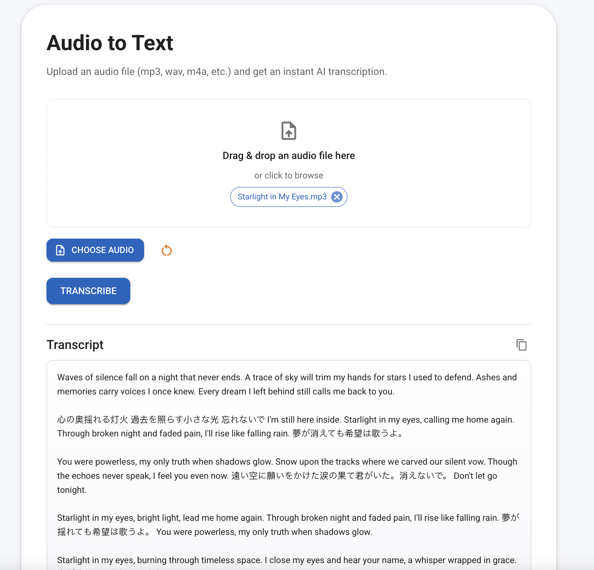

# Simple Transcribe AI Tool

Next.js 14 (App Router + TypeScript) application that lets you upload a single audio file and returns a cleaned, formatted transcript using OpenAI's `gpt-4o-transcribe` model for transcription and GPT-5 for text cleaning.



## Features

- Single audio file upload with drag & drop support (`audio/*`)
- Two-stage AI processing:
  - Audio transcription using OpenAI's `gpt-4o-transcribe` model
  - Intelligent text cleaning and formatting using GPT-5
- Graceful fallback to original transcription if cleaning fails
- Modern Material-UI interface with copy-to-clipboard functionality
- Backend API route (`/api/transcribe`) with comprehensive error handling
- Uses official `openai` Node SDK
- Full TypeScript support with comprehensive type definitions

## Prerequisites

- Node.js 20.11.1+ (or 20+ recommended)
- EITHER:
	- An OpenAI API key with access to `gpt-4o-transcribe` and GPT-5 models (public OpenAI), OR
	- An Azure OpenAI (Azure AI Foundry) resource with deployed transcription and text generation models (deployment names you create, e.g. `gpt-4o-transcribe` and `gpt-5`).

## Environment Variables

You can run with Public OpenAI or Azure OpenAI. If (and only if) all required Azure vars are present the API route prefers Azure; otherwise it uses Public OpenAI.

Public OpenAI:
```
OPENAI_API_KEY=<openai-api-key>
```

Azure OpenAI (Azure AI Foundry):
```
AZURE_OPENAI_ENDPOINT=https://<your-resource-name>.openai.azure.com
AZURE_OPENAI_API_KEY=<azure-openai-key>
AZURE_OPENAI_DEPLOYMENT=<your-deployment-name>   # e.g. gpt-4o-transcribe
AZURE_OPENAI_API_VERSION=2024-06-01              # optional; default used if omitted
```

Selection logic:
- If AZURE_OPENAI_ENDPOINT + AZURE_OPENAI_API_KEY + AZURE_OPENAI_DEPLOYMENT are all set -> Azure path is used.
- Otherwise falls back to OPENAI_API_KEY (Public OpenAI).

You may define both; Azure wins when its three core vars are present.

Security notes:
- Never commit real keys (.env is git-ignored; verify before pushing).
- Rotate keys if leaked.
- In production, use your platform secret manager (Vercel / Azure App Service / Container Apps, etc.).
- Remove unused vars to avoid confusion.

## .env Example

An example file is provided as `.env.example`. Copy and edit:

```bash
cp .env.example .env
```

Then fill in the values you need. Leave unused provider vars blank or delete them.

## Azure OpenAI (Azure AI Foundry) Deployment Steps

If you prefer Azure (good for enterprise governance, regional data residency, and quota isolation):

1. Create resource:
	- In Azure Portal search for "Azure OpenAI" (aka Azure AI Foundry) and create a resource.
	- Choose a region that supports the model (e.g., East US, Sweden Central – check current availability).
2. Get keys & endpoint:
	- Go to the resource > Keys & Endpoint. Copy one Key and the Endpoint URL (`https://<name>.openai.azure.com`).
3. Deploy a model:
	- Open the Azure AI Foundry (Studio) for the resource.
	- Go to Deployments > Create new.
	- Select the desired transcription-capable model (e.g. `gpt-4o-transcribe` or the closest available).
	- Set a deployment name (e.g. `gpt-4o-transcribe`). This exact string goes into `AZURE_OPENAI_DEPLOYMENT`.
4. (Optional) Confirm API version:
	- Use `2024-06-01` unless Azure docs direct otherwise. Put it in `AZURE_OPENAI_API_VERSION` if you need a different version.
5. Populate your `.env`:
	```
	AZURE_OPENAI_ENDPOINT=https://<your-resource-name>.openai.azure.com
	AZURE_OPENAI_API_KEY=<key>
	AZURE_OPENAI_DEPLOYMENT=gpt-4o-transcribe
	AZURE_OPENAI_API_VERSION=2024-06-01
	```
6. (Optional fallback) Keep `OPENAI_API_KEY` as a backup; if Azure vars are incomplete the app will use public OpenAI.

Testing your Azure deployment:
```bash
npm run dev
# Upload an audio file; watch server logs for whether Azure or public OpenAI was selected.
```

Troubleshooting:
- 401 / 403: Check key + endpoint + region match and the header usage (`api-key`).
- 404: Deployment name mismatch (must equal the deployment you created, not the base model name if different).
- Rate limiting: Review quota in the Azure resource (Usage + quotas blade) and scale or request increases.

## Local Setup & Run

1. Install dependencies:
	```bash
	npm install
	# or: pnpm install / yarn install
	```
2. Create env file:
	```bash
	cp .env.example .env
	# edit .env
	```
3. Run the dev server:
	```bash
	npm run dev
	```
4. Open http://localhost:3000

## Usage

1. Choose an audio file (e.g. `.mp3`, `.m4a`, `.wav`, `.ogg`) by clicking "Choose Audio" or drag & drop onto the upload area.
2. Click **Transcribe**.
3. Wait for the server to process the audio through two AI stages:
   - First, transcription using `gpt-4o-transcribe`
   - Then, text cleaning and formatting using GPT-5
4. View the cleaned, formatted transcript with copy-to-clipboard functionality.

**Note**: If text cleaning fails, the application will gracefully fall back to the original transcription to ensure you always get results.

## Architecture

The application follows a clean, modular architecture:

- **API Layer**: `src/app/api/transcribe/route.ts` - Main transcription endpoint
- **Services**: 
  - `src/lib/textCleaningService.ts` - GPT-5 text cleaning service
  - `src/lib/openAPIFactory.ts` - OpenAI client factory with dual provider support
- **Types**: `src/lib/types.ts` - Comprehensive TypeScript interfaces
- **Frontend**: Material-UI React components with drag & drop file upload
- **Testing**: Jest unit and integration tests with coverage reporting

## Text Cleaning Features

The GPT-5 text cleaning service provides:

- Grammar and punctuation correction
- Removal of filler words (um, uh, like, you know)
- Elimination of repetitions and false starts
- Proper paragraph breaks and sentence structure
- Consistent capitalization
- Meaning preservation without adding new information

## Notes

- The API route is implemented in `src/app/api/transcribe/route.ts`.
- Text cleaning uses a 30-second timeout with retry logic and graceful fallback.
- Increase `maxDuration` or adjust deployment platform settings if your audio files are long.
- Add file size/type validation as needed for production.
- For Azure, the code constructs `baseURL` with your deployment path. Do not add `model` in the request when using Azure (deployment chosen via URL); the code already handles this.
- All responses include proper TypeScript interfaces for type safety.

## Testing

The project includes comprehensive testing:

```bash
npm test                # Run all tests
npm run test:watch      # Run tests in watch mode
npm run test:coverage   # Generate coverage reports
```

Test coverage includes:
- Unit tests for text cleaning service
- Integration tests for the complete API flow
- Error handling and fallback scenarios
- Both Azure OpenAI and public OpenAI configurations

## Extending

Ideas to extend this project:

- Add language selection for transcription
- Support streaming partial transcripts
- Persist transcripts to a database
- Add authentication and user management
- Implement custom text cleaning prompts
- Add batch processing for multiple files
- Support for different output formats (JSON, SRT, etc.)

## License

MIT
